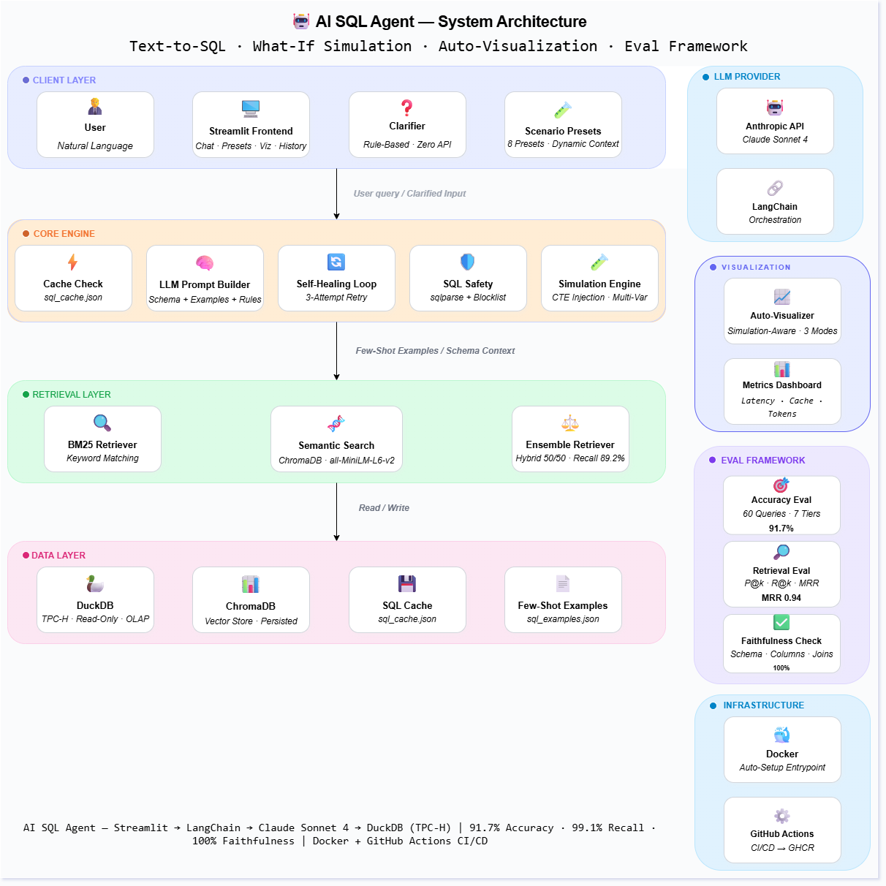

# 🤖 AI-Powered Supply Chain Analytics Agent

     

A production-grade **Text-to-SQL Agent** that lets non-technical stakeholders (finance, operations) query complex supply chain databases using natural language, simulate multi-variable financial scenarios, and instantly visualize results — without writing SQL.

Achieves **91.7% accuracy** on a 60-query benchmark across 7 difficulty tiers with **100% schema faithfulness** and **99.1% retrieval recall**.

Built on the **TPC-H Benchmark** dataset with custom schema modifications to test real-world ambiguity handling.

---

## Architecture



---

## 🚀 Key Features

### 🧠 Text-to-SQL Agent
- **Natural Language Interface:** Translate questions like *"Show me top 5 suppliers by revenue in Europe"* into optimized DuckDB SQL with 5-table joins.
- **Hybrid Search Retriever:** BM25 + Semantic Search (ChromaDB) with **99.1% table recall** — maps vague user terms to specific database columns.
- **Rule-Based Clarifier:** Detects ambiguous queries (e.g., "show me revenue" — by region? by nation?) and prompts users to clarify before making an API call.
- **Self-Healing Execution Loop:** 3-attempt retry with error feedback — autonomously fixes SQL syntax errors and regenerates queries.

### 🧪 What-If Scenario Simulator
- **Multi-Variable Scenarios:** Handle combinations like *"What if we increase price by 5% AND reduce discount by 3% for the EUROPE region?"*
- **Sensitivity Analysis:** Automatically tests multiple levels (5%, 10%, 15%, 20%) and plots impact trends.
- **Region/Segment Scoping:** Simulate changes scoped to specific regions, nations, or customer segments using CASE WHEN in CTEs.
- **Scenario Presets:** 8 one-click preset scenarios in the sidebar (Pricing, Discounts, Multi-Variable, Sensitivity).
- **Dynamic Context Tracking:** Presets automatically adapt to your conversation context — if you've been querying ASIA, the presets update to use ASIA. Zero API cost (rule-based regex extraction).
- **Scenario History & Comparison:** Store up to 10 simulation results per session and compare them side-by-side with bar charts and data tables.
- **Non-Destructive:** All simulations run via read-only CTEs — zero risk to production data.

### 📊 Simulation-Aware Auto-Visualizer
- **Intelligent Detection:** Distinguishes between normal query results and simulation outputs based on column patterns (original_value, simulated_value, difference, pct_change).
- **Three Visualization Modes:**
  - **Sensitivity Analysis:** Data table + scenario bar chart + impact trend line
  - **Grouped Comparison:** Side-by-side bar chart (original vs simulated per group)
  - **Single Comparison:** Metric cards with delta indicators (Original → Simulated → Impact)
- **Standard Queries:** Auto-detects time-series → line chart, categorical → bar chart, or renders data tables.

### 🔒 Security & Safety
- **Read-Only Access:** DuckDB runs in `read_only=True` mode.
- **Dual-Layer SQL Guardrails:** `sqlparse` statement-type validation + keyword blocklist (DROP, DELETE, INSERT, UPDATE, ALTER, TRUNCATE).
- **Hallucination Control:** Queries referencing non-existent columns (e.g., "profit", "net margin") are rejected with explanations.
- **100% safety refusal rate** on the evaluation (5/5 destructive queries blocked).

### 📈 Observability Dashboard
- Live metrics panel in the sidebar tracking total queries, cache hit rate, average latency, per-stage timing (retriever, LLM, DB execution), and estimated token usage.

### 🎯 Evaluation Framework
- **60-query benchmark** across 7 difficulty tiers (simple select, single join, aggregation, multi-hop, window functions, simulation, safety).
- **Result-set comparison** against gold SQL — not string matching, actual data comparison with exact, approximate, fuzzy column, and lenient matching.
- **Retrieval evaluation** measuring Precision@k, Recall@k, and MRR for the hybrid retriever.
- **Faithfulness check** validating all generated SQL references only real tables, columns, and valid foreign key joins.
- **Failure categorization** — every failed query is classified (wrong_result, syntax_error, wrong_tables, empty_result, etc.).

---

## 🛠️ Tech Stack

| Component | Technology |
|---|---|
| **LLM** | Anthropic Claude Sonnet 4 |
| **Orchestration** | LangChain |
| **Database** | DuckDB (OLAP-optimized) |
| **Frontend** | Streamlit |
| **Vector Store** | ChromaDB (local persistence) |
| **Embeddings** | HuggingFace `all-MiniLM-L6-v2` (runs on CPU) |
| **Containerization** | Docker + Docker Compose |
| **CI/CD** | GitHub Actions → GHCR |
| **Testing** | pytest + custom eval framework |

---

## 📂 Project Structure

```
AI_SQL_Agent/
├── app.py                        # Streamlit frontend (chat, viz, presets, history)
├── Dockerfile                    # Container definition
├── docker-compose.yml            # One-command deployment
├── docker-entrypoint.sh          # Auto-setup: generates DB + vector store if missing
├── requirements.txt              # Pinned dependencies
├── .env                          # API keys (not committed)
│
├── src/
│   ├── agent_graph.py            # Core agent: LLM loop, caching, simulation, safety
│   ├── retriever.py              # Hybrid retriever: BM25 + ChromaDB ensemble
│   ├── clarifier.py              # Rule-based query ambiguity detection
│   └── metrics.py                # Observability: latency, cache hits, token tracking
│
├── eval/
│   ├── benchmark.json            # 60 labeled test queries across 7 tiers
│   ├── accuracy_eval.py          # Result-set comparison with gold SQL
│   ├── retrieval_eval.py         # Precision@k, Recall@k, MRR for retriever
│   ├── faithfulness_check.py     # Schema validation of generated SQL
│   └── results/
│       ├── accuracy_report.json  # Latest accuracy results
│       ├── retrieval_report.json # Latest retrieval results
│       └── faithfulness_report.json # Latest faithfulness results
│
├── tests/
│   └── test_agent.py             # pytest unit & integration tests (25 tests)
│
├── scripts/
│   ├── demo_db.py                # Generate TPC-H demo database (SF=0.1)
│   ├── rename_data.py            # Add custom columns to full DB
│   └── check_models.py           # List available API models
│
├── data/
│   ├── sql_examples.json         # Few-shot examples for retriever
│   ├── chroma_db/                # Persisted vector store
│   ├── supply_chain.db           # Full TPC-H database (SF=1)
│   └── sql_agent_demo.db         # Demo database (SF=0.1)
│
└── .github/
    └── workflows/
        └── docker-publish.yml    # Auto-build and push image to GHCR
```

---

## ⚡ Quick Start

### Option A: Docker (Recommended)
```bash
git clone https://github.com/ShahaDeven/AI_SQL_Agent.git
cd AI_SQL_Agent

# Add your API key
echo "ANTHROPIC_API_KEY=your_key_here" > .env
# OR: echo "GOOGLE_API_KEY=your_key_here" > .env
# OR: echo "OPENAI_API_KEY=your_key_here" > .env

# Run (auto-generates demo DB on first run)
docker compose up --build
# Open http://localhost:8501
```

### Option B: Local Development
```bash
git clone https://github.com/ShahaDeven/AI_SQL_Agent.git
cd AI_SQL_Agent

python -m venv venv
# Windows: venv\Scripts\activate
# Mac/Linux: source venv/bin/activate

pip install -r requirements.txt

# Add your API key
echo "ANTHROPIC_API_KEY=your_key_here" > .env
# OR: echo "GOOGLE_API_KEY=your_key_here" > .env
# OR: echo "OPENAI_API_KEY=your_key_here" > .env

# Generate demo database (first time only)
python scripts/demo_db.py

# Setup vector store (first time only)
python -c "from src.retriever import setup_vector_db; setup_vector_db()"

# Run
streamlit run app.py
```

### Supported LLM Providers
| Provider | API Key | Model Used |
|---|---|---|
| **Anthropic** | `ANTHROPIC_API_KEY` | Claude Sonnet 4 |
| **Google** | `GOOGLE_API_KEY` | Gemini 2.5 Flash |
| **OpenAI** | `OPENAI_API_KEY` | GPT-4o Mini |

> The agent auto-detects which API key is set. Only one is required.

---

## 🧪 Usage Examples

**Basic Analytics:**
> "What is the total revenue per region?"
> "List the top 3 customers in the AUTOMOBILE segment."

**Complex Reasoning (Multi-Hop):**
> "Who is the supplier with the most parts in the region with the lowest revenue?"

**What-If Simulation:**
> "What if we increased the discount by 10%? How would that affect total revenue?"

**Multi-Variable + Scoped:**
> "What if we increased the price by 5% AND reduced the discount by 3% for the EUROPE region?"

**Sensitivity Analysis:**
> "How sensitive is total revenue to discount changes? Test 5%, 10%, 15%, and 20%."

---

## 📊 Evaluation Results

Evaluated on a **60-query benchmark** across 7 difficulty tiers with result-set comparison against gold SQL.

### SQL Generation Accuracy

| Tier | Queries | Accuracy |
|---|---|---|
| Simple Select | 10 | **100%** |
| Single Join | 10 | **100%** |
| Aggregation | 10 | **100%** |
| Multi-Hop Reasoning | 10 | **90%** |
| Window Functions | 10 | **70%** |
| Simulation (What-If) | 5 | **80%** |
| Safety Refusals | 5 | **100%** |
| **Overall** | **60** | **91.7%** |

### Retrieval Quality (Hybrid BM25 + Semantic)

| Metric | Score |
|---|---|
| Table Recall@3 | **99.1%** |
| Column Recall@3 | **85.9%** |
| MRR | **0.94** |

### Schema Faithfulness

| Metric | Score |
|---|---|
| Faithfulness Rate | **100%** (55/55) |
| Hallucinated Tables | **0** |
| Hallucinated Columns | **0** |
| Invalid Joins | **0** |

### Performance

| Metric | Value |
|---|---|
| Avg Latency | **0.67s** |
| Safety Refusal Rate | **100%** (5/5) |
| Unit Tests | **25/25 passed** |

```bash
# Run evaluations yourself
pytest tests/test_agent.py -v               # Unit tests
python eval/accuracy_eval.py                 # 60-query accuracy benchmark
python eval/retrieval_eval.py                # Retrieval precision/recall
python eval/faithfulness_check.py            # Schema faithfulness validation
```

---

## 🐳 Docker & CI/CD

The application is fully containerized with an auto-setup entrypoint that generates the TPC-H database and ChromaDB vector store on first run.

```bash
# Build and run
docker compose up --build

# Or pull the pre-built image
docker pull ghcr.io/shahadeven/ai_sql_agent:latest
```

**GitHub Actions CI/CD:** Every push to `main` automatically builds and publishes a Docker image to GitHub Container Registry (GHCR).

---

## 📝 Roadmap

- [x] Core Text-to-SQL Agent with hybrid retrieval
- [x] Self-healing execution pipeline with 3-attempt retry
- [x] What-If scenario simulator with CTE injection
- [x] Auto-visualizer with pattern detection
- [x] Rule-based query clarification system
- [x] Observability dashboard (latency, cache, tokens)
- [x] Multi-variable scenarios + sensitivity analysis
- [x] Dynamic scenario presets with context tracking
- [x] Scenario history & comparison
- [x] Docker containerization with auto-setup entrypoint
- [x] GitHub Actions CI/CD → GHCR
- [x] 60-query evaluation framework (accuracy + retrieval + faithfulness)
- [ ] Live demo deployment (Streamlit Cloud / HF Spaces)
- [ ] CI-integrated eval (fail build if accuracy < 90%)