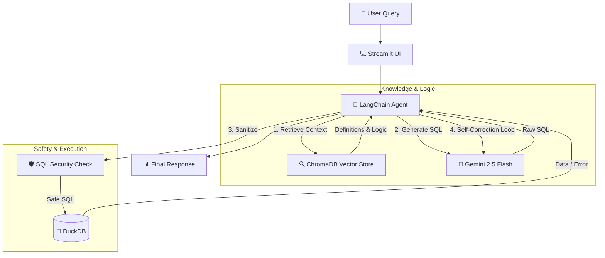

# 🤖 AI Supply Chain Agent (RAG + SQL)

An intelligent **SQL Agent** capable of answering complex business questions about Supply Chain data (TPC-H).

Unlike basic "Text-to-SQL" bots, this agent uses **Retrieval Augmented Generation (RAG)** to understand custom business logic (e.g., *"High Risk"* customers) and employs **Self-Healing** mechanisms to correct its own SQL errors.

---

## 🚀 Key Features

| Feature | Description |
| :--- | :--- |
| **🧠 Semantic Understanding** | Uses a Vector Database (**ChromaDB**) to inject business context. It knows that *"Revenue"* is calculated as `total_value * (1 - promo_reduction)`, logic that exists nowhere in the schema itself. |
| **🛡️ Enterprise Security** | • **Database:** Strict `READ_ONLY` connection to DuckDB. • **App Level:** `sqlparse` logic blocks destructive commands (`DROP`, `DELETE`, `UPDATE`) before execution. |
| **❤️‍🩹 Self-Healing SQL** | If a generated query fails (syntax or logic), the agent reads the error, reflects, and **retries automatically** up to 3 times. |
| **📊 Dynamic UI** | Built with **Streamlit**, featuring interactive data tables and a live Database Schema Explorer. |
| **⚡ Dual-Mode Engine** | Automatically switches between a full **1GB local dataset** and a lightweight **"Demo Mode" (100MB)** for cloud deployment. |

---

## 🏗️ Architecture

The system follows a multi-step reasoning pipeline to ensure accuracy and safety.

